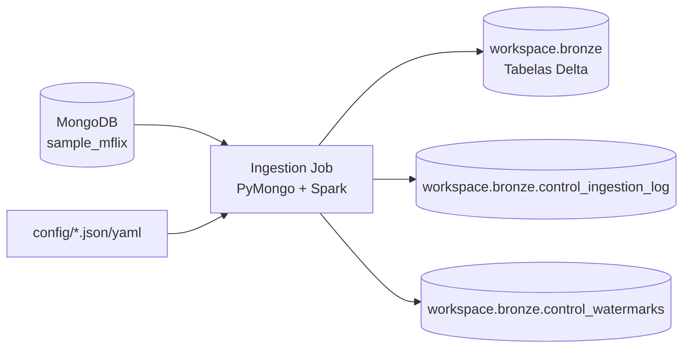

# Ingestao Moderna de Dados - sample_mflix

Pipeline generica para ingerir colecoes do banco `sample_mflix` do MongoDB para a camada Bronze em Delta Lake no Databricks.

## Objetivo

O projeto extrai dados do MongoDB Atlas, materializa os documentos na camada Bronze e registra rastreabilidade tecnica por execucao. A implementacao prioriza codigo parametrizado, controle de watermark, logs de execucao e validacoes basicas de qualidade.

## Arquitetura



## Estrutura

```text
config/
  collections.json
  pipeline_config.yaml
jobs/
  ingestion_job.py
docs/
  ARQUITETURA.md
  evidencias/
code-samples/
  mongo_reader.py
  create-secret.py
```

## Configuracao

A configuracao geral fica em `config/pipeline_config.yaml`.

Principais parametros:

```yaml
mongodb:
  connection_secret_scope: conn-db
  connection_secret_key: cnn-mongodb-sampleflix
  connection_env_var: MONGODB_URI

bronze:
  catalog: workspace
  schema: bronze
  file_format: delta
  partition_column: _ingestion_date
```

As colecoes ficam parametrizadas em `config/collections.json`.

| Colecao | Modo | Watermark | Projection |
|---|---|---|---|
| `movies` | incremental | `lastupdated` | exclui `poster` |
| `comments` | incremental | `date` | documento completo |
| `users` | full | - | exclui `password` |
| `theaters` | full | - | documento completo |
| `sessions` | full | - | exclui `jwt` |
| `embedded_movies` | full | - | exclui `plot_embedding` |

## Como Executar

No Databricks, instale as dependencias:

```python
%pip install pymongo pyyaml
dbutils.library.restartPython()
```

Garanta que o schema Bronze existe:

```sql
CREATE SCHEMA IF NOT EXISTS workspace.bronze;
```

Importe e execute o job:

```python
import sys

sys.path.append("/Workspace/Users/saravs@camed.com.br/T3-DE-INGESTAO")

from jobs.ingestion_job import IngestionJob

job = IngestionJob(
    "/Workspace/Users/saravs@camed.com.br/T3-DE-INGESTAO/config/pipeline_config.yaml",
    "/Workspace/Users/saravs@camed.com.br/T3-DE-INGESTAO/config/collections.json",
)

job.run("users")
```

Para processar uma colecao incremental:

```python
job = IngestionJob(
    "/Workspace/Users/saravs@camed.com.br/T3-DE-INGESTAO/config/pipeline_config.yaml",
    "/Workspace/Users/saravs@camed.com.br/T3-DE-INGESTAO/config/collections.json",
)

job.run("comments")
```

Para processar todas as colecoes configuradas:

```python
job = IngestionJob(
    "/Workspace/Users/saravs@camed.com.br/T3-DE-INGESTAO/config/pipeline_config.yaml",
    "/Workspace/Users/saravs@camed.com.br/T3-DE-INGESTAO/config/collections.json",
)

job.run()
```

## Decisoes Tecnicas

### Pipeline generica

O job `jobs/ingestion_job.py` usa um unico componente de ingestao para todas as colecoes. O comportamento muda por configuracao: banco, colecao, modo de carga, campo de watermark, projection e tabela de destino.

### Camada Bronze

A Bronze grava os documentos como JSON bruto em `_raw_document`, preservando a fidelidade da origem e evitando perda de informacao por schema drift. As tabelas sao Delta e particionadas por `_ingestion_date`.

Colunas tecnicas adicionadas:

| Coluna | Descricao |
|---|---|
| `_source_id` | `_id` original do MongoDB convertido para string |
| `_raw_document` | documento original serializado em JSON |
| `_ingestion_id` | UUID da execucao |
| `_ingestion_timestamp` | timestamp UTC da ingestao |
| `_source_path` | sistema de origem |
| `_load_type` | `full` ou `incremental` |
| `_ingestion_date` | data de particionamento |
| `_rescued_data` | coluna reservada para registros com problema de conversao |

### Watermark

A tabela `workspace.bronze.control_watermarks` persiste o ultimo valor processado por colecao. Em execucoes incrementais, o filtro usa registros com valor maior que a watermark anterior.

Campos incrementais:

| Colecao | Campo | Tipo |
|---|---|---|
| `comments` | `date` | datetime |
| `movies` | `lastupdated` | string |

### Idempotencia

Para cargas incrementais, a watermark evita reler registros ja processados. A execucao sem dados novos registra `qtd_lida_origem = 0` e nao duplica registros.

Para cargas full, a estrategia atual grava nova fotografia da colecao com novo `_ingestion_id`. A deduplicacao para consumo analitico deve considerar `_source_id` e a execucao mais recente na camada Silver.

### Boas Praticas de Recursos

Tecnicas adotadas:

| Tecnica | Implementacao |
|---|---|
| Leitura em lotes | uso de `batch_size` no cursor do MongoDB |
| Projection/pushdown | exclusao de campos sensiveis ou pesados no MongoDB |
| Evita `toPandas()` | processamento feito em Spark DataFrames |
| Reuso de conexao | um `MongoClient` por execucao do job |
| Controle de particionamento | Bronze particionada por `_ingestion_date` |

Campos excluidos por projection:

| Colecao | Campo | Motivo |
|---|---|---|
| `users` | `password` | dado sensivel sem valor analitico |
| `sessions` | `jwt` | token sensivel |
| `embedded_movies` | `plot_embedding` | campo muito largo |
| `movies` | `poster` | URL/campo largo sem necessidade na Bronze deste trabalho |

### Schema Drift

A estrategia escolhida e persistir o documento como JSON bruto em `_raw_document`, com colunas tecnicas padronizadas. Essa abordagem evita falhas quando documentos da mesma colecao possuem campos ausentes, campos novos ou tipos divergentes. Na camada Silver, o schema pode ser inferido ou aplicado explicitamente por dominio.

### Qualidade e Reconciliacao

A cada execucao, o job registra:

| Campo | Descricao |
|---|---|
| `qtd_lida_origem` | quantidade lida do MongoDB |
| `qtd_gravada_destino` | quantidade escrita na Bronze |
| `status` | `SUCCESS`, `FAILED` ou `PARTIAL` |
| `mensagem_erro` | erro capturado, quando houver |

Validacoes implementadas:

| Validacao | Comportamento |
|---|---|
| `_source_id` nulo | falha o lote |
| `_source_id` duplicado no lote | falha o lote |
| divergencia entre origem e leitura | marca execucao como `PARTIAL` |

## Evidencias

As evidencias devem ser salvas em `docs/evidencias/`.

Execucoes ja validadas no Databricks:

| Execucao | Colecao | Resultado esperado |
|---|---|---|
| Full inicial | `users` | `185` registros e `SUCCESS` |
| Incremental inicial | `comments` | carga inicial com registros e `SUCCESS` |
| Incremental sem novidades | `comments` | `0` registros e `SUCCESS` |
| Incremental com novos dados | `comments` | novos registros e `SUCCESS` |

## Limitacoes Conhecidas

- O job deve ser instanciado novamente entre chamadas separadas no notebook, pois a conexao MongoDB e fechada ao final de `run()`.
- A carga full atual grava uma nova fotografia append-only. A selecao do registro mais recente por `_source_id` fica para a camada Silver.
- O script `code-samples/create-secret.py` veio como material de apoio; antes da entrega final, qualquer URI real deve ser removida ou mascarada.

## Consultas Uteis

```python
spark.table("workspace.bronze.users").display()
spark.table("workspace.bronze.comments").display()
spark.table("workspace.bronze.control_ingestion_log").display()
spark.table("workspace.bronze.control_watermarks").display()
```
