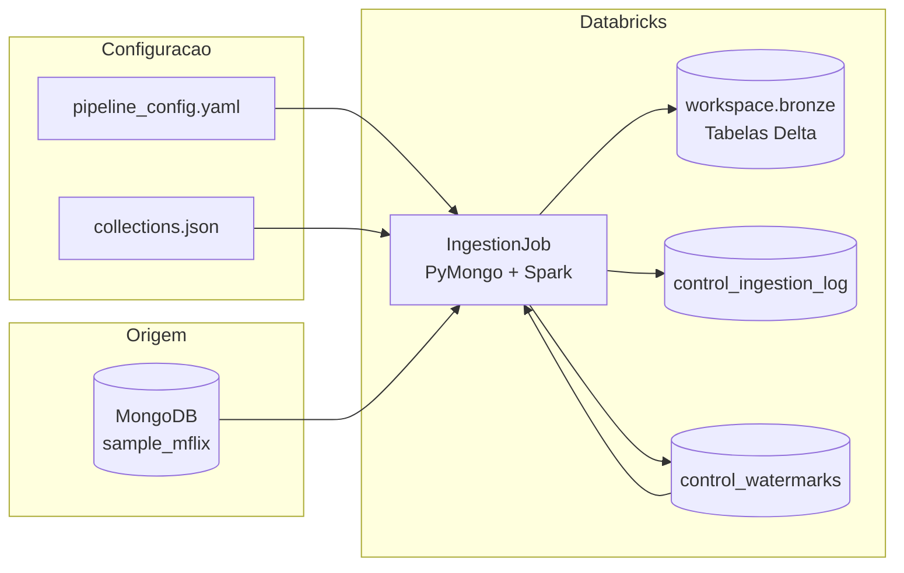

# Arquitetura - Ingestao sample_mflix

Este documento descreve a arquitetura real implementada para ingestao das colecoes do MongoDB `sample_mflix` na camada Bronze do Databricks.

## Fluxo



## Componentes

### Origem

- Sistema: MongoDB
- Banco: `sample_mflix`
- Acesso: secret Databricks `conn-db/cnn-mongodb-sampleflix`
- Biblioteca: `pymongo`

### Configuracao

A pipeline nao possui colecoes hardcoded no codigo principal. Os parametros ficam externalizados:

- `config/pipeline_config.yaml`: parametros gerais da pipeline, secret, destino, qualidade e recursos.
- `config/collections.json`: lista de colecoes, modo de carga, watermark, projection e tabela destino.

### Job de Ingestao

Arquivo principal:

```text
jobs/ingestion_job.py
```

Responsabilidades:

- ler configuracoes;
- conectar ao MongoDB;
- montar filtro incremental quando aplicavel;
- ler documentos em lotes;
- serializar documentos como JSON bruto;
- adicionar colunas de rastreabilidade;
- gravar Delta na Bronze;
- persistir watermark;
- registrar execucao na tabela de controle;
- executar validacoes basicas de qualidade.

### Bronze

Catalogo/schema:

```text
workspace.bronze
```

Tabelas de dados:

```text
workspace.bronze.movies
workspace.bronze.comments
workspace.bronze.users
workspace.bronze.theaters
workspace.bronze.sessions
workspace.bronze.embedded_movies
```

Formato:

```text
Delta Lake
```

Particionamento:

```text
_ingestion_date
```

### Controle

Tabelas de controle:

```text
workspace.bronze.control_ingestion_log
workspace.bronze.control_watermarks
```

A `control_ingestion_log` registra uma linha por execucao por colecao. Ela permite responder:

- qual colecao foi processada;
- quando foi processada;
- qual foi o tipo de carga;
- quantos registros foram lidos e gravados;
- qual foi o status;
- qual erro ocorreu, se houver.

A `control_watermarks` guarda o ultimo valor processado em cargas incrementais.

## Decisoes Tecnicas

### Formato da Bronze

Decisao: usar Delta Lake.

Justificativa: Delta e o formato nativo mais aderente ao Databricks, permite tabelas gerenciadas, particionamento, consultas SQL, evolucao futura e integracao com Unity Catalog.

### Landing

Decisao: nao foi criada uma landing zone em arquivos neste escopo inicial. A ingestao le diretamente do MongoDB e grava na Bronze.

Justificativa: o requisito obrigatorio e materializar a camada Bronze. A decisao reduz complexidade operacional e mantem a fidelidade da origem por meio da coluna `_raw_document`.

### Trigger do job

Decisao: execucao manual em notebook Databricks durante o trabalho.

Justificativa: o foco da entrega obrigatoria e a pipeline parametrizada, watermark, controle e evidencias. A orquestracao por workflow pode ser adicionada como evolucao ou bonus.

### Idempotencia

Decisao: usar watermark persistida para cargas incrementais.

Justificativa: ao finalizar uma execucao incremental com sucesso, a maior watermark lida e registrada em `control_watermarks`. Na proxima execucao, o filtro busca apenas documentos com valor maior que a watermark anterior. Assim, uma execucao incremental sem novidades retorna zero registros e nao duplica dados.

Observacao: cargas full sao append-only e registram nova fotografia da colecao. A deduplicacao analitica por `_source_id` e execucao mais recente deve ser feita na camada Silver.

### Schema Drift

Decisao: persistir o documento original como JSON bruto em `_raw_document`, acompanhado de colunas tecnicas padronizadas.

Justificativa: colecoes NoSQL podem ter campos ausentes, campos novos e tipos divergentes entre documentos. Manter JSON bruto evita falhas de schema na Bronze e preserva informacao para tratamento posterior na Silver.

### Projections

Decisao: aplicar projection no MongoDB para excluir campos sensiveis ou pesados.

Justificativa: reduz trafego, memoria e risco de exposicao de dados.

| Colecao | Campo excluido | Motivo |
|---|---|---|
| `users` | `password` | dado sensivel |
| `sessions` | `jwt` | token sensivel |
| `embedded_movies` | `plot_embedding` | campo largo de embeddings |
| `movies` | `poster` | campo largo sem necessidade neste escopo |

## Modos de Carga

| Colecao | Modo | Watermark field | Justificativa |
|---|---|---|---|
| `movies` | incremental | `lastupdated` | colecao grande com campo de atualizacao |
| `comments` | incremental | `date` | maior volume e campo de data nativo |
| `users` | full | - | colecao pequena e estavel |
| `theaters` | full | - | volume moderado e sem watermark natural |
| `sessions` | full | - | colecao pequena ou vazia |
| `embedded_movies` | full | - | volume controlado, com projection para remover embedding |

## Colunas da Bronze

| Coluna | Descricao |
|---|---|
| `_source_id` | identificador original do documento no MongoDB |
| `_raw_document` | documento serializado em JSON |
| `_ingestion_id` | UUID da execucao |
| `_ingestion_timestamp` | timestamp UTC da gravacao |
| `_source_path` | origem logica, `mongodb_atlas` |
| `_load_type` | `full` ou `incremental` |
| `_ingestion_date` | data de particionamento |
| `_rescued_data` | coluna reservada para tratamento de registros invalidos |

## Qualidade e Reconciliacao

Validacoes implementadas:

| Validacao | Resultado |
|---|---|
| `_source_id` nulo | falha a execucao |
| `_source_id` duplicado no lote | falha a execucao |
| contagem lida diferente da contagem esperada na origem | marca como `PARTIAL` |

Campos registrados em `control_ingestion_log`:

```text
_ingestion_id
collection
load_type
watermark_inicial
watermark_final
qtd_lida_origem
qtd_gravada_destino
start_time
end_time
duracao_seg
status
mensagem_erro
```

## Evidencias

As evidencias de execucao ficam em:

```text
docs/evidencias/
```

Arquivo atual:

```text
docs/evidencias/control_ingestion_log_execucoes.csv
```
