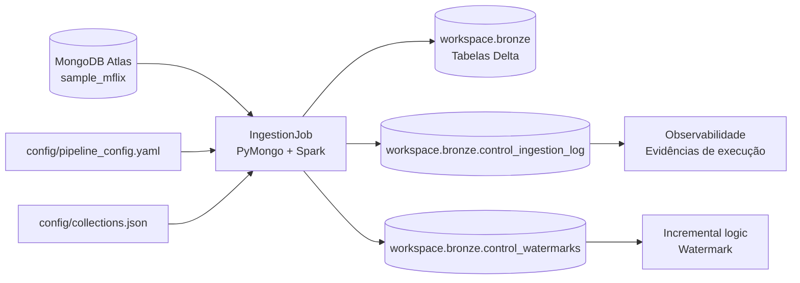

# Arquitetura da Solução

## Visão geral

A solução implementa uma pipeline de ingestão genérica para extrair documentos do MongoDB Atlas `sample_mflix` e persistir os dados na camada Bronze em Delta Lake, com controle de execução, watermark para cargas incrementais e rastreabilidade técnica de cada registro.

## Fluxo arquitetural

## Componentes

### 1. Origem
- Banco de dados: `sample_mflix`
- Sistema origem: MongoDB Atlas
- Acesso: segredo/variável de ambiente do Databricks
- Biblioteca de acesso: `pymongo`

### 2. Configuração
- `config/pipeline_config.yaml`: parâmetros globais da solução
- `config/collections.json`: lista de coleções, carga, projection e watermark

Esses arquivos deixam a pipeline parametrizada e reutilizável, evitando hardcode de coleção, destino ou política de carga.

### 3. Job de ingestão
- Arquivo principal: `jobs/ingestion_job.py`
- Responsabilidades:
  - leitura do arquivo de configuração;
  - conexão com o MongoDB;
  - filtro incremental por watermark;
  - leitura em batches;
  - serialização do documento em JSON bruto;
  - validação de qualidade;
  - gravação na Bronze em Delta;
  - persistência de watermark;
  - registro de execução no log de controle.

### 4. Camada Bronze
- Formato: Delta Lake
- Schema: `workspace.bronze`
- Tabelas por coleção, por exemplo:
  - `workspace.bronze.movies`
  - `workspace.bronze.comments`
  - `workspace.bronze.users`
  - `workspace.bronze.theaters`
  - `workspace.bronze.sessions`
  - `workspace.bronze.embedded_movies`

A camada Bronze preserva o dado como veio da origem, com colunas técnicas de rastreabilidade e um campo bruto de documento (`_raw_document`).

### 5. Controle e observabilidade
- `workspace.bronze.control_ingestion_log`
  - armazena uma linha por execução
  - registra status, contagem lida, contagem gravada, watermark inicial/final, duração e o cenário da execução
  - inclui o campo `execution_case`, que identifica se a carga foi `INITIAL_FULL`, `FULL_REPROCESS`, `INCREMENTAL_NO_NEW_DATA` ou `INCREMENTAL_WITH_NEW_DATA`
- `workspace.bronze.control_watermarks`
  - persiste o último valor processado por coleção em cargas incrementais

## Padrão de ingestão

### Full load
Coleções menores e estáveis são processadas em modo full, reprocessando a coleção inteira em cada execução.

### Incremental load
Coleções com campo temporal como `date` ou `lastupdated` usam watermark persistido para somente capturar registros novos ou alterados.

### Cenários de execução registrados no log

A tabela de controle registra explicitamente o cenário da execução por meio do campo `execution_case`:

- `INITIAL_FULL`: primeira execução full da coleção
- `FULL_REPROCESS`: reprocessamento full da coleção
- `INCREMENTAL_NO_NEW_DATA`: carga incremental sem novos registros após o watermark
- `INCREMENTAL_WITH_NEW_DATA`: carga incremental com registros novos efetivamente processados

Esse mapeamento permite separar visualmente e auditoriar cada cenário sem criar múltiplas tabelas de log.

## Rastreabilidade

Cada registro gravado na Bronze contém colunas técnicas como:
- `_source_id`
- `_raw_document`
- `_ingestion_id`
- `_ingestion_timestamp`
- `_source_path`
- `_load_type`
- `_ingestion_date`
- `_rescued_data`
- `_source_hash`

Essas colunas permitem auditoria, rastreio e reconciliação entre origem e destino.

## Tratamento de schema drift

Como o MongoDB é schemaless, documentos podem variar em campos e tipos. A solução opta por:
- manter o documento bruto em `_raw_document`;
- padronizar colunas técnicas;
- preservar registros problemáticos em `_rescued_data` e/ou em validações de qualidade.

Essa abordagem reduz falhas de execução e permite que a camada Silver faça a normalização adequada.

## Idempotência e robustez de execução

A idempotência é tratada como uma boa prática operacional e de integridade dos dados. A arquitetura garante que:
- execuções repetidas não duplicam registros já persistidos na Bronze;
- a carga incremental usa watermark persistido para evitar reprocessamento de documentos antigos;
- o controle de execução grava uma linha de auditoria por execução, preservando rastreabilidade sem conflitar com os dados de negócio;
- a combinação de `_source_id` e `_source_hash` permite distinguir documento original de versão nova do mesmo registro.

Isso torna a pipeline segura para reexecução, retry e validação em ambientes de desenvolvimento e produção.

## Boas práticas aplicadas

- leitura em batches via cursor do MongoDB;
- projection para excluir campos sensíveis ou pesados;
- uso de Delta Lake e particionamento por `_ingestion_date`;
- uso de watermark para cargas incrementais;
- idempotência para evitar duplicidade na camada Bronze;
- logging de execução para observabilidade e auditoria.

## Observações finais

A arquitetura foi pensada para manter alto nível de fidelidade à origem, robustez operacional e rastreabilidade em cada execução, atendendo ao escopo do trabalho de ingestão de dados em ambiente Databricks.
